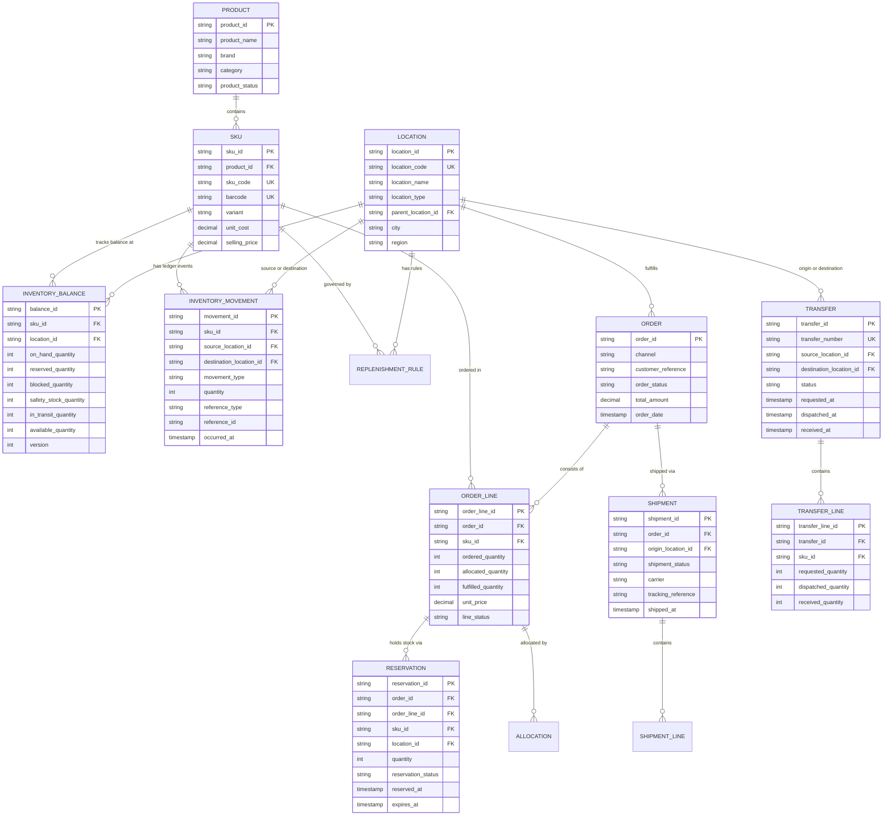

# StockMind AI — Entity Relationship Diagram (ERD)

```mermaid
erDiagram
    PRODUCT ||--o{ SKU : "contains"
    PRODUCT {
        string product_id PK
        string product_name
        string brand
        string category
        string product_status
    }

    SKU ||--o{ INVENTORY_BALANCE : "tracks balance at"
    SKU ||--o{ INVENTORY_MOVEMENT : "has ledger events"
    SKU ||--o{ REPLENISHMENT_RULE : "governed by"
    SKU ||--o{ ORDER_LINE : "ordered in"
    SKU {
        string sku_id PK
        string product_id FK
        string sku_code UK
        string barcode UK
        string variant
        decimal unit_cost
        decimal selling_price
    }

    LOCATION ||--o{ INVENTORY_BALANCE : "holds stock"
    LOCATION ||--o{ INVENTORY_MOVEMENT : "source or destination"
    LOCATION ||--o{ REPLENISHMENT_RULE : "has rules"
    LOCATION ||--o{ ORDER : "fulfills"
    LOCATION ||--o{ TRANSFER : "origin or destination"
    LOCATION {
        string location_id PK
        string location_code UK
        string location_name
        string location_type
        string parent_location_id FK
        string city
        string region
    }

    INVENTORY_BALANCE {
        string balance_id PK
        string sku_id FK
        string location_id FK
        int on_hand_quantity
        int reserved_quantity
        int blocked_quantity
        int safety_stock_quantity
        int in_transit_quantity
        int available_quantity
        int version
    }

    INVENTORY_MOVEMENT {
        string movement_id PK
        string sku_id FK
        string source_location_id FK
        string destination_location_id FK
        string movement_type
        int quantity
        string reference_type
        string reference_id
        timestamp occurred_at
    }

    ORDER ||--o{ ORDER_LINE : "consists of"
    ORDER ||--o{ SHIPMENT : "shipped via"
    ORDER {
        string order_id PK
        string channel
        string customer_reference
        string order_status
        decimal total_amount
        timestamp order_date
    }

    ORDER_LINE ||--o{ RESERVATION : "holds stock via"
    ORDER_LINE ||--o{ ALLOCATION : "allocated by"
    ORDER_LINE {
        string order_line_id PK
        string order_id FK
        string sku_id FK
        int ordered_quantity
        int allocated_quantity
        int fulfilled_quantity
        decimal unit_price
        string line_status
    }

    RESERVATION {
        string reservation_id PK
        string order_id FK
        string order_line_id FK
        string sku_id FK
        string location_id FK
        int quantity
        string reservation_status
        timestamp reserved_at
        timestamp expires_at
    }

    TRANSFER ||--o{ TRANSFER_LINE : "contains"
    TRANSFER {
        string transfer_id PK
        string transfer_number UK
        string source_location_id FK
        string destination_location_id FK
        string status
        timestamp requested_at
        timestamp dispatched_at
        timestamp received_at
    }

    TRANSFER_LINE {
        string transfer_line_id PK
        string transfer_id FK
        string sku_id FK
        int requested_quantity
        int dispatched_quantity
        int received_quantity
    }

    SHIPMENT ||--o{ SHIPMENT_LINE : "contains"
    SHIPMENT {
        string shipment_id PK
        string order_id FK
        string origin_location_id FK
        string shipment_status
        string carrier
        string tracking_reference
        timestamp shipped_at
    }
```
